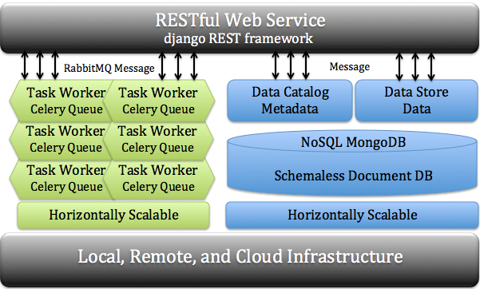

cyberCommons Framework!
=======================

The cyberCommons Framework is a loosely coupled service-orientated reference architecture for distributed computing workflows. The framework is implemented as a series of Docker contained services coupled together by a Python RESTful API. These containers in the reference architecture use MongoDB, RabbitMQ, Django RESTful and Celery to build a loosely coupled and horizontally scaleable software stack. This reference stack can be used to manage data, catalog metadata, and register computational worker nodes with defined tasks. Computations can be scaled across a series of worker nodes on bare-metal or virtualized environments. This architecture stack serves as the reference environments used by The University of Oklahoma Libraries Informatics team to automate distributed workflows and manage digital objects. The framework provides a flexible accessible interface for distributed processing and data management from multiple environments including command-line, programming languages, and web and mobile applications.

The cyberCommons Framework currently deployed across a wide variety of environments.

1. `University of Oklahoma Libraries <https://libraries.ou.edu/>`__ at
   the University of Oklahoma.
2. `University of Colorado Libraries <https://www.colorado.edu/libraries/>`__ at
   the University of Colorado.
3. `The Oklahoma Water Survey <http://www.ou.edu/okh2o>`__ water data web portal.
4. `US Congressional Hearings Search Engine <https://cc.lib.ou.edu/hearings/>`__
5. `Latin Search Engine <https://cc.lib.ou.edu/latin-portal/>`__
6. `Northern Arizona University EcoPAD <https://ecolab.nau.edu/ecopad_portal/>`__ is an
   ecological platform for data assimilation and forecasting in ecology.
7. `US Congressional Hearings Search Engine <https://cc.lib.ou.edu/hearings/>`__
8. `The Oklahoma Biological Survey <http://www.biosurvey.ou.edu/>`__
9. `The Earth Observation Modeling facility <http://eomf.ou.edu/>`__
10. `MGMIC <http://mgmic.oscer.ou.edu/>`__ (MetaGenome analysis for
   Microbiologically Influenced Corrosion Studies)
11. `The South Central Climate Sciences Center <http://southcentralclimate.org/>`__

Contents:

.. toctree::
   :maxdepth: 2
   :numbered:

   installation
   configuration
   remote_worker
   rest_api
   permissions
   help
   authors
