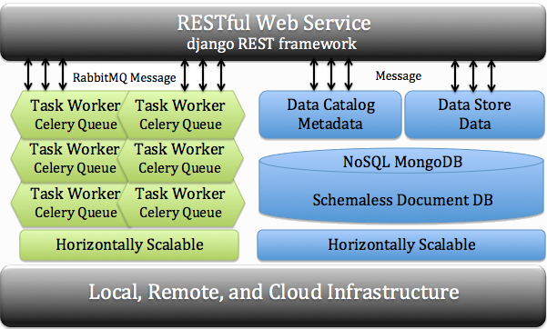

.. cyberCommons Framework documentation master file, created by
   sphinx-quickstart on Thu Jul 22 10:49:00 2021.
   You can adapt this file completely to your liking, but it should at least
   contain the root `toctree` directive.

cyberCommons Framework!
=======================

The cyberCommons Framework is a loosely coupled service-orientated reference architecture for distributed computing workflows. The framework is composed of a series of Docker contained services combined by a Python RESTful API. These containers in the reference architecture use MongoDB, RabbitMQ, Django RESTful and Celery to build a loosely coupled and horizontally scalable software stack. This reference stack can be used to manage data, catalog metadata, and register computational worker nodes with defined tasks. Computations can scale across a series of worker nodes on bare-metal or virtualized environments. The framework provides a flexible, accessible interface for distributed processing and data management from multiple environments including command-line, programming languages, and web and mobile applications.

The cyberCommons Framework currently deployed across a wide variety of environments.

1. `University of Colorado Libraries <https://www.colorado.edu/libraries/>`__ at
   the University of Colorado Boulder.
2. `University of Oklahoma Libraries <https://libraries.ou.edu/>`__ at
   the University of Oklahoma.
3. `US Congressional Hearings Search Engine <https://cc.lib.ou.edu/hearings/>`__
4. `Latin Search Engine <https://cc.lib.ou.edu/latin-portal/>`__
5. `Northern Arizona University EcoPAD <https://www2.nau.edu/luo-lab/?ecopad>`__ is an
   ecological platform for data assimilation and forecasting in ecology.
6. `The Oklahoma Biological Survey <http://www.biosurvey.ou.edu/>`__
7. `The Earth Observation Modeling facility <http://eomf.ou.edu/>`__
8. `The South Central Climate Sciences Center <http://southcentralclimate.org/>`__
9. `The Oklahoma Water Survey <http://www.ou.edu/okh2o>`__

Table of Contents
===========================================================

Contents:

.. toctree::
   :maxdepth: 1
   :numbered:
   :caption: Installation/Configuration

   pages/installation
   pages/configuration
   pages/remote_worker

.. toctree::
   :maxdepth: 1
   :caption: REST API 

   pages/rest_api
   pages/permissions
   pages/help
   pages/authors
